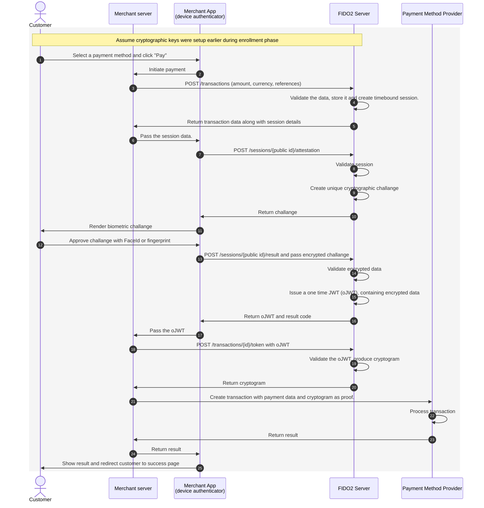
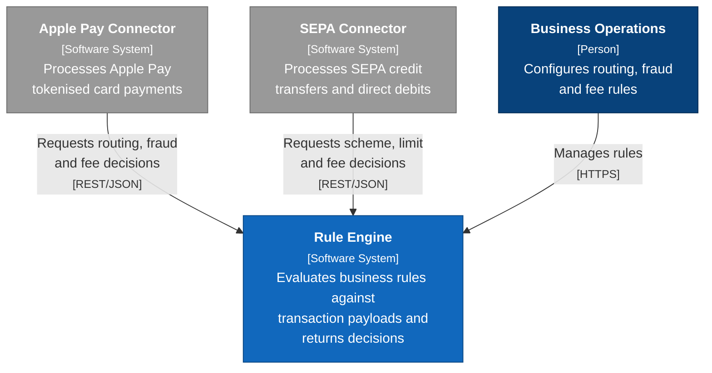
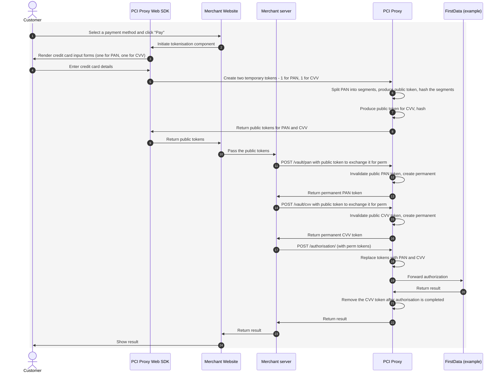

# Todor Dimitrov

_Selected work in payments security, compliance and platform architecture._

[GitHub](https://github.com/todor-di) · [LinkedIn](https://www.linkedin.com/in/todordim/)

This page covers three products I've built, each as a short case study: the problem, the solution, how it works, and its impact.

1. [Delegated Authentication Solution (FIDO2)](#1-delegated-authentication-solution-fido2)
2. [Rule Engine Micro-service](#2-rule-engine-micro-service)
3. [PCI Proxy Tokenization Component](#3-pci-proxy-tokenization-component)

---

## 1. Delegated Authentication Solution (FIDO2)

**Introduce a SCA solution for frictionless checkout for a major Nordic retail chain.**

### The problem

3-D Secure is mandatory for card payments within Europe, however for non-card payment methods, the authentication is not standardized and is done via multiple channels. This causes friction and abandonment during payment sessions.

### The solution

I led the design and delivery of a FIDO2-based **delegated authentication** flow. The solution marries the transaction data, created by the merchant with the specific cryptographic proof, created on the customer's device. The result is a SCA compatible cryptogram, which is time bound, transaction bound and can be validated by any stakeholder that takes part in the payment process.

### How it works

The API handshake between the merchant app, the FIDO2 server, the e-wallet and the issuer:



### Impact

- **User experience:** No waiting, no redirects, no confusing windows opening and closing.
- **Authorisation rate:** Improved by 10% for non-card payments. Currently being discussed with issuers to accept it instead of 3-D Secure.
- **Conversion:** Reduce the dropout and error rate by 15%
- **Compliance:** FIDO2 certified and compliant. Currently being discussed for SCA replacement for issuers in Nordics.

---

## 2. Rule Engine Micro-service

**Systems thinking: a decoupled, scalable architecture that lets the business change its own rules.**

### The problem

Payment routing, fraud detection and fee calculation logic is often hard-coded into monoliths. Changing even a simple business rule then costs developer time and a full deployment cycle.

### The solution

I architected an isolated rule engine micro-service. It evaluates business logic dynamically against each incoming transaction payload. Rules are stored and versioned as code so the business has flexibility to do whatever it needs.

### How it works

The structure follows the [C4 model](https://c4model.com). The Apple Pay and SEPA connectors are example clients.

**Level 1: System context.** Who uses the rule engine, and which systems depend on it:



### Main concepts

**Rule** - A javascript code, which is executed in a secure environment on the server. The code and the server belong to the same entity and access to both is restricted. <br>
**Rule set** - A collection of rules with sequence of execution. <br>
**Triggers** - Defined via rule management API. Each trigger is created to reflect a specific processing step and service. <br>
**Contracts** - The format of messages being exchanged for each trigger. <br>
**Run rules** - A specific execution environment, which allows rule creators to test their code execution. Each rule must comply with specific requirement (execution time, memory consumption), otherwise it cannot be included in a rule-set. <br>
**Connectors** - A list of pre-defined functions, which rule creators can invoke in their javascript code (such as external systems, caching or data storage). Some example connectors are "list", "dictionary" or "call". 

**Example: Making a SEPA payment on sepa-input trigger**:

**Request**
```json
POST /triggers/sepa-input/
{
  "transactionId": "txn_8f2c1a",
  "amount": { "value": 1250.00, "currency": "EUR" },
  "reference": "Your_Order_12345",
  "paymentMethod": {
    "type": "sepadirectdebit",
    "ownerName": "A. Klaassen",
    "ibanNumber": "NL98ABNA0410108103"
  },
  "returnUrl": "https://your-company.com/checkout/success",
  "merchantAccount": "YourMerchantAccount",
  "channel": "ECOM"
}
```
**Response**

```json
{
  "transactionId": "txn_8f2c1a",
  "amount": { "value": 1250.00, "currency": "EUR" },
  "reference": "Your_Order_12345",
  "paymentMethod": {
    "type": "sepadirectdebit",
    "ownerName": "A. Klaassen",
    "ibanNumber": "NL98ABNA0410108103"
  },
  "returnUrl": "https://your-company.com/checkout/success",
  "merchantAccount": "YourMerchantAccount",
  "channel": "ECOM",
  "evaluation": {
    "ruleSet": "f47ac10b-58cc-4372-a567-0e02b2c3d479",
    "ruleSetVersionStamp": "hiu597ag...",
    "startProcessingAt": "17907785582312",
    "finishProcessingAt": "17907785583711",
    "isSuccess": true,
    "isStopped": false
  },
  "actions": [
    {
      "op": "add",
      "path": "riskScore",
      "value": 75
    },
    {
      "op": "add",
      "path": "multipayment",
      "value": true
    },
    {
      "op": "add",
      "path": "merchantAccounts",
      "value": [{"accountNumber":"YourMerchantAccount", "merchantName":"myMerchantName"}, {"accountNumber":"Somenumber", "merchantName":"someName"}]
    }
  ]
}
```

### Impact

- **Time-to-market for new rules:** from 2 weeks of developer effort and a release cycle to 4 hours of operational configuration.
- **Developer friendly:** Testing is done in isolation with pre-defined conditions that must be met. Misconfiguration, exception handling and memory issues are caught in advance.
- **Decoupling:** routing, fraud, and fee logic moved out of the core services, so rule changes no longer need a deployment.
- **Traceability:** every decision is recorded with the rule-set version and evaluation path, for audit and dispute handling.

---

## 3. PCI Proxy Tokenization Component

**High-stakes compliance, risk reduction and enterprise data security.**

### The problem

Any system that stores, processes or transmits a raw Primary Account Number (PAN) and/or CVV falls within PCI-DSS scope. Handling raw card data puts merchants and payment providers into the highest and most expensive compliance tiers.

### The solution

I designed a proxy that intercepts raw card data before it reaches the merchant's backend. It produces a token, which is not bound by any acquirer/issuer and can be later used to create network tokens. 

### How it works


#### Notes

- **BIN Check:** The proxy component also supports BIN checks with data returned by the schemes.
- **POS handling:** PIN encryption for POS devices is also supported.
- **3DS Server:** Schemes provide a DS matching based on BIN, which can also be included in the component.
- **Network tokenisation:** Network tokens can also be created with MC and VISA during processing.


### Impact

- **Reduced compliance scope:** the merchant's PCI-DSS scope is downgraded to **SAQ A** or **SAQ A-EP** instead of a full SAQ D / Report on Compliance.
- **Cost savings:** Removes the price for tokens stored at a provider entirely.
- **Risk reduction:** Limiting all PCI DSS scope into one service. This offers a far greater system flexibility.
