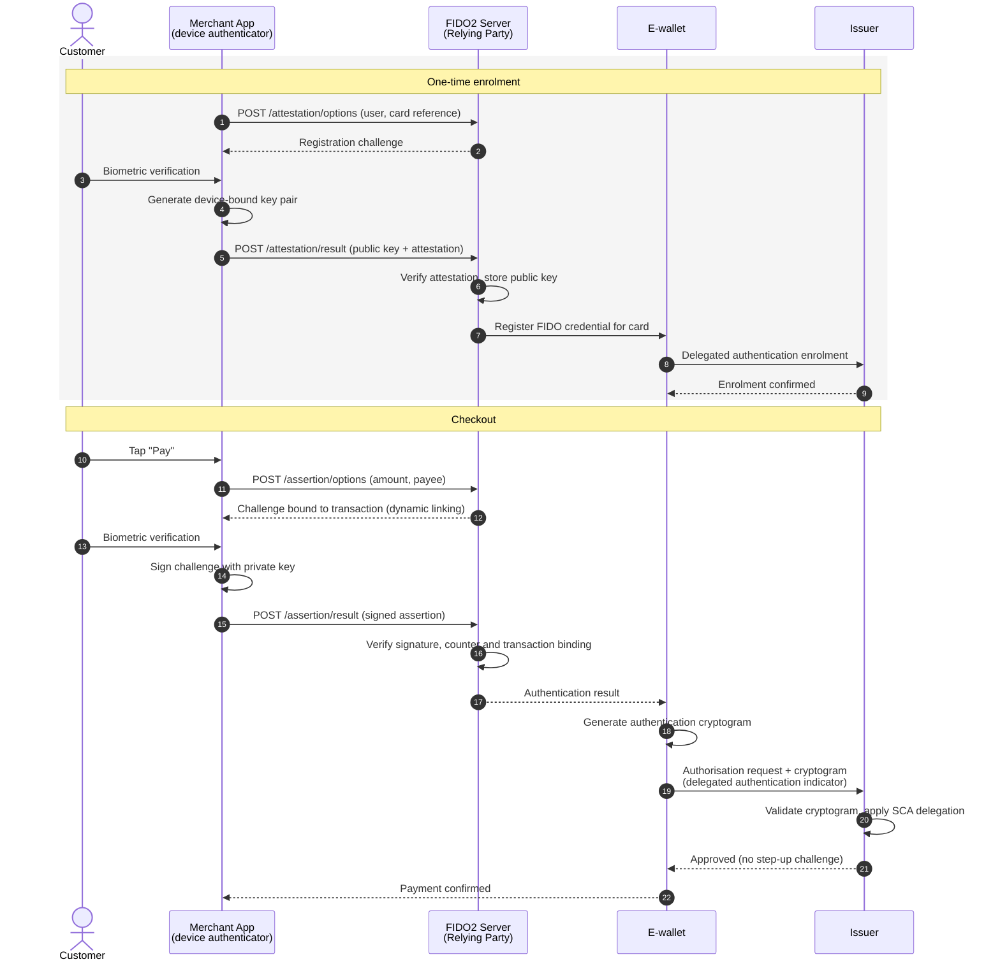
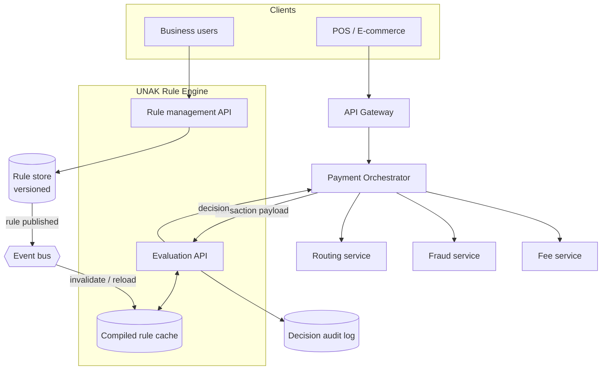
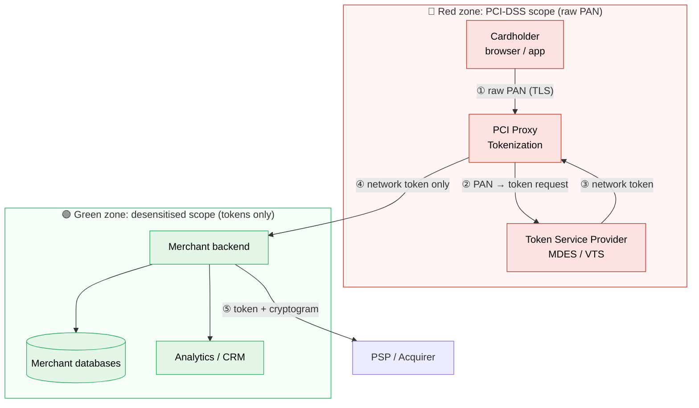

# Todor Dimitrov

_Selected work in payments security, compliance and platform architecture._

[GitHub](https://github.com/todor-di) · [LinkedIn](https://www.linkedin.com/in/your-profile)

This page covers three products I've built, each as a short case study: the problem, the solution, how it works, and its impact.

1. [Delegated Authentication Solution (FIDO2)](#1-delegated-authentication-solution-fido2)
2. [UNAK Rule Engine Micro-service](#2-unak-rule-engine-micro-service)
3. [PCI Proxy Tokenization Component](#3-pci-proxy-tokenization-component)

---

## 1. Delegated Authentication Solution (FIDO2)

**Meeting strict European security regulation (PSD2 / SCA) with a frictionless checkout for a major Nordic retail chain.**

### The problem

Traditional 3-D Secure challenges and SMS one-time passwords add friction to e-wallet checkout. They cause cart abandonment, yet the merchant still has to meet PSD2 Strong Customer Authentication (SCA) requirements.

### The solution

I led the design and delivery of a FIDO2-based **delegated authentication** flow. The merchant authenticates the customer locally with device biometrics, which covers both SCA factors: possession (the device-bound key) and inherence (the biometric). The resulting authentication cryptogram goes directly to the issuer, which can then approve the payment without a second challenge.

### How it works

The API handshake between the merchant app, the FIDO2 server, the e-wallet and the issuer:



### Impact

- **Checkout latency:** _[e.g. authentication step reduced from ~X s to ~Y s]_
- **Authorisation rate:** _[e.g. +X percentage points]_
- **Conversion:** _[e.g. X% fewer abandoned carts at checkout]_
- **Compliance:** full PSD2 SCA compliance maintained, with no 3-D Secure or OTP challenge in the happy path.

---

## 2. UNAK Rule Engine Micro-service

**Systems thinking: a decoupled, scalable architecture that lets the business change its own rules.**

### The problem

Payment routing, fraud detection and fee calculation logic is often hard-coded into monoliths. Changing even a simple business rule then costs developer time and a full deployment cycle.

### The solution

I architected UNAK, an isolated rule engine micro-service. It evaluates business logic dynamically against each incoming transaction payload. Rules are stored and versioned as data rather than code, so the business can change them without a release.

### How it works

Where the rule engine sits within the wider micro-services ecosystem:



**Example: a transaction payload evaluated against a sample decision tree** (sanitised):

```json
{
  "transactionId": "txn_8f2c1a",
  "amount": { "value": 1250.00, "currency": "EUR" },
  "card": { "scheme": "VISA", "type": "CREDIT", "issuerCountry": "SE" },
  "merchant": { "mcc": "5411", "country": "SE" },
  "channel": "ECOM",
  "riskScore": 72
}
```

```json
{
  "ruleSet": "payment-routing",
  "version": 14,
  "tree": {
    "if": { "field": "riskScore", "op": "gte", "value": 80 },
    "then": { "decision": "DECLINE", "reason": "HIGH_RISK" },
    "else": {
      "if": { "all": [
        { "field": "card.issuerCountry", "op": "eq", "value": "{merchant.country}" },
        { "field": "amount.value", "op": "lt", "value": 5000 }
      ]},
      "then": {
        "if": { "field": "riskScore", "op": "gte", "value": 60 },
        "then": { "decision": "ROUTE", "acquirer": "DOMESTIC_A", "requireSca": true },
        "else": { "decision": "ROUTE", "acquirer": "DOMESTIC_A", "requireSca": false }
      },
      "else": { "decision": "ROUTE", "acquirer": "CROSS_BORDER_B", "requireSca": true }
    }
  }
}
```

```json
{
  "transactionId": "txn_8f2c1a",
  "ruleSet": "payment-routing",
  "version": 14,
  "decision": "ROUTE",
  "acquirer": "DOMESTIC_A",
  "requireSca": true,
  "path": ["riskScore < 80", "domestic and amount < 5000", "riskScore >= 60"],
  "evaluatedInMs": 2
}
```

### Impact

- **Time-to-market for new rules:** from _[weeks]_ of developer effort and a release cycle to _[minutes]_ of operational configuration.
- **Decoupling:** routing, fraud and fee logic moved out of the core services, so rule changes no longer need a deployment.
- **Traceability:** every decision is recorded with the rule-set version and evaluation path, for audit and dispute handling.
- _[Optional: throughput / latency figures, e.g. X decisions per second at p99 < Y ms]_

---

## 3. PCI Proxy Tokenization Component

**High-stakes compliance, risk reduction and enterprise data security.**

### The problem

Any system that stores, processes or transmits a raw Primary Account Number (PAN) falls within PCI-DSS scope. Handling raw PANs puts merchants and payment providers into the highest and most expensive compliance tiers.

### The solution

I designed a proxy that intercepts PAN data before it reaches the merchant's backend. It swaps the PAN for a **network token** (EMVCo, via Mastercard MDES / Visa VTS), so the core systems only ever handle desensitised data.

### How it works

Raw card data stays inside the red zone. Only tokens cross into the merchant's green zone.



### Impact

- **Reduced compliance scope:** the merchant's PCI-DSS scope is downgraded, e.g. to **SAQ A** or **SAQ A-EP** instead of a full SAQ D / Report on Compliance.
- **Cost savings:** _[e.g. annual audit and compliance cost reduced by X]_
- **Risk reduction:** a breach of the merchant's systems exposes only tokens, which are useless outside their domain.
- **Authorisation uplift:** network tokens stay valid when cards are reissued _[e.g. +X% authorisation rate]_.
